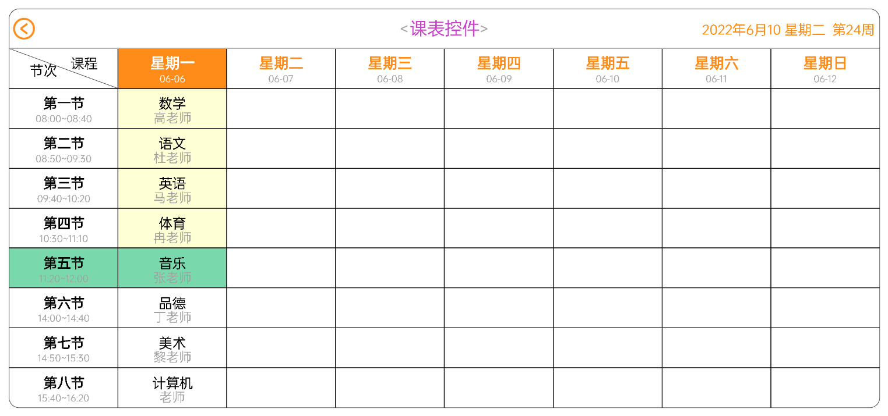

# ClassScheduleView
横屏课表 
# 预览

# 资源
|名字|资源|
|-|-|
|AAR|[class_schedule_view.aar](https://github.com/RelinRan/ClassScheduleView/blob/master/class_schedule_view.aar)|
|Gitee|[ClassScheduleView](https://gitee.com/relin/ClassScheduleView)|
|GitHub |[ClassScheduleView](https://github.com/RelinRan/ClassScheduleView)|
# Maven
1.build.grade | setting.grade
```
repositories {
	...
	maven { url 'https://jitpack.io' }
}
```
2./app/build.grade
```
dependencies {
	implementation 'com.github.RelinRan:ClassScheduleView:2022.6.10.1'
}
```
# xml
```
<com.androidx.widget.ClassScheduleView
    android:id="@+id/csv"
    android:layout_width="match_parent"
    android:background="@android:color/white"
    android:layout_height="320dp"/>
```
# attr.xml
```
<!--行数-->
<attr name="rowCount" format="integer|reference" />
<!--列数-->
<attr name="columnCount" format="integer|reference" />
<!--标题-->
<attr name="titleName" format="string|reference" />
<!--日期时间 2018年07月23日 星期一 第23周-->
<attr name="dateTime" format="string|reference" />
<!--外边距圆角-->
<attr name="borderRadius" format="dimension|reference" />
<!--标题高度-->
<attr name="titleHeight" format="dimension|reference" />
<!--标题左边距-->
<attr name="titleLeftPadding" format="dimension|reference" />
<!--标题右边距-->
<attr name="titleRightPadding" format="dimension|reference" />
<!--标题字体大小-->
<attr name="titleTextSize" format="dimension|reference" />
<!--标题分割线颜色-->
<attr name="titleDividerColor" format="color|reference" />
<!--标题文字颜色-->
<attr name="titleTextColor" format="color|reference" />
<!--标题左右箭头颜色-->
<attr name="titleTextLeftRightColor" format="color|reference" />
<!--标题左右箭头大小-->
<attr name="titleTextLeftRightArrowSize" format="dimension|reference" />
<!--日期时间颜色-->
<attr name="dateTimeColor" format="color|reference" />
<!--时间日期字体大小-->
<attr name="dateTimeTextSize" format="dimension|reference" />
<!--分割线颜色-->
<attr name="dividerColor" format="color|reference" />
<!--返回按钮颜色-->
<attr name="backCircleColor" format="color|reference" />
<!--边框线颜色-->
<attr name="backCircleWidth" format="dimension|reference" />
<!--边框线颜色-->
<attr name="borderLineColor" format="color|reference" />
<!--Item点击颜色-->
<attr name="itemPressedColor" format="color|reference" />
```
# Activity全屏
```
requestWindowFeature(Window.FEATURE_NO_TITLE);
getWindow().setFlags(WindowManager.LayoutParams.FLAG_FULLSCREEN, WindowManager.LayoutParams.FLAG_FULLSCREEN);
setContentView(R.layout.xxx);
getSupportActionBar().hide();
```
# 代码使用
```
//找到控件
ClassScheduleView csv = findViewById(R.id.csv);

//设置行数(默认8)
csv.setRowCount(8);
//设置列数（默认9）
csv.setColumnCount(9);

//设置标题
csv.setTitle("课表控件");
csv.setTitleTextColor(Color.parseColor("#CB42CA"));
csv.setDateTime("2022-06-10 星期五 第30周");//不设置，会默认采用当前时间显示

//设置课程item
csv.setItemText(1, 1, "数学", "高老师");//星期一 第1节
csv.setItemText(1, 2, "语文", "杜老师");//星期一 第2节
csv.setItemText(1, 3, "英语", "马老师");//星期一 第3节
csv.setItemText(1, 4, "体育", "冉老师");//星期一 第4节
csv.setItemText(1, 5, "音乐", "张老师");//星期一 第5节
csv.setItemText(1, 6, "品德", "丁老师");//星期一 第6节
csv.setItemText(1, 7, "美术", "黎老师");//星期一 第7节
csv.setItemText(1, 8, "计算机", "老师");//星期一 第8节

//设置课程item背景
csv.setItemBackgroundColor(1, 4, Color.parseColor("#22B67E"));
csv.setItemBackgroundColor(1, 5, Color.parseColor("#7AD8AD"));
csv.setSectionItemBackgroundColor(5, Color.parseColor("#7AD8AD"));
csv.setWeekItemBackgroundColor(1, Color.parseColor("#FF8B18"));
csv.setWeekColumnItemBackgroundColor(1, 4, Color.parseColor("#FFFFD6"));

//设置字体
csv.setDateTimeTextSize(14);
csv.setWeekItemAllTextSize(15, 10);
csv.setSectionItemTextSize(8, 14, 10);
csv.setWeekItemTextColor(1, Color.parseColor("#FFFFFF"), Color.parseColor("#FFFFFF"));

//返回按钮事件
csv.setOnBackClickListener(new ClassScheduleView.OnBackClickListener() {
    @Override
    public void onBackClick() {
        finish();
    }
});

//Item点击事件
csv.setOnItemClickListener(new ClassScheduleView.OnItemClickListener() {
    @Override
    public void onItemClick(ItemOptions options, int row, int column, String name, String mark) {
        Log.e("ClassScheduleView", "name:" + name + ",mark:" + mark);
    }
});
```
